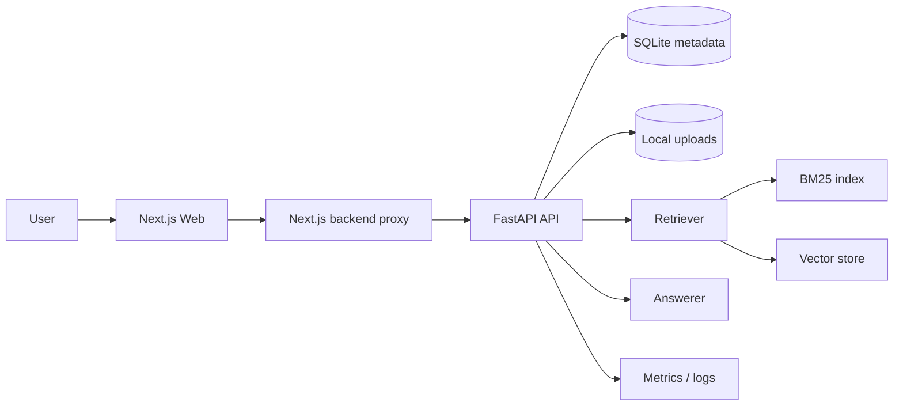

# rag-smart-qa

Production-style RAG system with a FastAPI backend and a Next.js frontend. The app supports document upload, grounded Q&A with citations, summaries, settings, and OAuth-based frontend auth.

## Stack

- Backend: FastAPI, Pydantic, Chroma/FAISS-ready retrieval, BM25, grounded answer generation
- Frontend: Next.js 14, TypeScript, Auth.js, dark/light theme
- Storage: local files, SQLite metadata, local index persistence
- Ops: Prometheus metrics, structured logging, Docker support, evaluation scripts

## Architecture



## What’s in the repo

- [`src/`](/Users/thamaraiselvang/Pritheev%20Projects/rag-smart-qa/src) FastAPI app, services, retrieval, generation, schemas, utilities
- [`web/`](/Users/thamaraiselvang/Pritheev%20Projects/rag-smart-qa/web) Next.js frontend with marketing pages, auth, and app UI
- [`tests/`](/Users/thamaraiselvang/Pritheev%20Projects/rag-smart-qa/tests) backend tests
- [`docs/`](/Users/thamaraiselvang/Pritheev%20Projects/rag-smart-qa/docs) architecture, deployment, API, security, tradeoffs
- [`experiments/metrics/`](/Users/thamaraiselvang/Pritheev%20Projects/rag-smart-qa/experiments/metrics) saved evaluation artifacts

## Local setup

### Backend

```bash
python3 -m venv .venv
source .venv/bin/activate
pip install -U pip
pip install -r requirements.txt
pip install -e .
cp .env.example .env
```

If you want the demo API key locally, make sure [`.env`](/Users/thamaraiselvang/Pritheev%20Projects/rag-smart-qa/.env) contains:

```env
RAG_API_KEYS=changeme-reviewer-key
```

### Frontend

```bash
cd web
npm install
cp .env.example .env.local
```

At minimum, set these in [`web/.env.local`](/Users/thamaraiselvang/Pritheev%20Projects/rag-smart-qa/web/.env.local):

```env
AUTH_SECRET=
AUTH_GITHUB_ID=
AUTH_GITHUB_SECRET=
AUTH_GOOGLE_ID=
AUTH_GOOGLE_SECRET=
NEXT_PUBLIC_API_BASE_URL=http://127.0.0.1:8000
BACKEND_API_KEY=changeme-reviewer-key
NEXTAUTH_URL=http://localhost:3000
```

## Running the project

### Start the backend

```bash
source .venv/bin/activate
make ingest
make index
make api
```

Backend URLs:

- API: `http://127.0.0.1:8000`
- Docs: `http://127.0.0.1:8000/docs`

### Start the frontend

```bash
cd web
npm run dev
```

Frontend URL:

- App: `http://localhost:3000`

## Backend auth note

The FastAPI backend uses `x-api-key` when API-key auth is enabled. The Next.js app is wired so browser requests go through a server-side proxy route and the backend key stays on the server side.

## Main backend routes

- `POST /query`
- `POST /api/v1/chat/query`
- `GET /api/v1/chat/sessions`
- `GET /api/v1/documents`
- `POST /api/v1/documents/upload`
- `GET /api/v1/documents/{id}`
- `GET /api/v1/documents/{id}/summary`
- `GET /api/v1/settings`

## Checks

Backend:

```bash
source .venv/bin/activate
ruff check src tests evaluation/resume_metrics.py
mypy src tests evaluation/resume_metrics.py
pytest --cov=src --cov-report=term-missing --cov-report=xml -q
```

Frontend:

```bash
cd web
npm run build
```

## Docs

- API contract: [docs/api_contract.md](/Users/thamaraiselvang/Pritheev%20Projects/rag-smart-qa/docs/api_contract.md)
- Architecture: [docs/architecture.md](/Users/thamaraiselvang/Pritheev%20Projects/rag-smart-qa/docs/architecture.md)
- Deployment: [docs/deployment.md](/Users/thamaraiselvang/Pritheev%20Projects/rag-smart-qa/docs/deployment.md)
- Security: [docs/security.md](/Users/thamaraiselvang/Pritheev%20Projects/rag-smart-qa/docs/security.md)

## License

MIT
