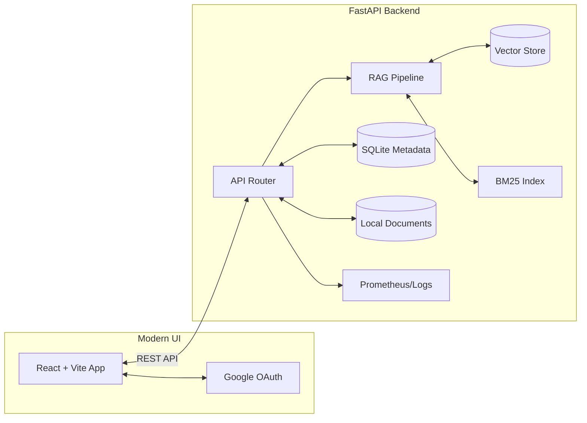

# SmartQA 🧠

[](https://fastapi.tiangolo.com/)
[](https://reactjs.org/)
[](https://vitejs.dev/)
[](https://www.typescriptlang.org/)
[](https://www.python.org/)

SmartQA is a production-ready, commercial-grade Retrieval-Augmented Generation (RAG) system with a premium, sleek user interface. It combines a highly optimized FastAPI backend with a modern React+Vite frontend, offering an intuitive, ChatGPT-like experience with robust document grounding and citations.

## ✨ Key Features

### Frontend (User Experience)
*   **Premium Dark Mode UI**: A stunning "Midnight & Electric Violet" aesthetic with soft gradients, glassmorphism, and smooth micro-animations.
*   **Google OAuth Integration**: Secure, seamless one-click authentication.
*   **Interactive Chat Panel**: ChatGPT-style conversational interface with streaming responses and inline markdown rendering.
*   **Intelligent Composer**: Responsive input handling with auto-expanding text areas and real-time validation.

### Backend (Core RAG Engine)
*   **Advanced Retrieval Engine**: Hybrid search capabilities using BM25 and Vector stores (Chroma/FAISS-ready).
*   **Grounded Answer Generation**: Ensures high-accuracy responses backed by uploaded document citations.
*   **Production Ops Integration**: Built-in Prometheus metrics, structured logging, and robust Docker support.
*   **Comprehensive APIs**: Fully documented RESTful endpoints for documents, sessions, and configuration via Swagger UI.

---

## 🏗 Architecture



---

## 🚀 Getting Started

### Prerequisites

*   Python 3.10+
*   Node.js 18+ and npm
*   Google Cloud Console account (for OAuth credentials)

### 1. Backend Setup

```bash
# Navigate to the root directory
python3 -m venv .venv
source .venv/bin/activate
pip install -U pip
pip install -r requirements.txt
pip install -e .

# Configure environment
cp .env.example .env
# Edit .env to add your keys (e.g., RAG_API_KEYS)
```

**Start the Backend Server:**
```bash
make ingest
make index
make api
```
*API running at `http://127.0.0.1:8000` | Docs at `http://127.0.0.1:8000/docs`*

### 2. Frontend Setup

```bash
# Navigate to the frontend directory
cd frontend
npm install

# Configure environment
cp .env.example .env.local
# Add your Google Client ID to .env.local
# VITE_GOOGLE_CLIENT_ID="your-client-id"
```

**Start the Frontend Development Server:**
```bash
npm run dev
```
*App running at `http://localhost:5173`*

---

## 📂 Project Structure

*   `frontend/`: React/Vite/TypeScript frontend application with premium UI components.
*   `src/`: Python FastAPI backend app, RAG pipelines, retrieval engines, and API schemas.
*   `tests/`: Comprehensive backend test suite.
*   `docs/`: Detailed project documentation (Architecture, Deployment, API Contracts, Security).
*   `experiments/`: Jupyter notebooks and evaluation scripts for RAG metrics.

---

## 🛠 Testing & Quality Assurance

**Run Backend Checks:**
```bash
source .venv/bin/activate
ruff check src tests evaluation/resume_metrics.py
mypy src tests evaluation/resume_metrics.py
pytest --cov=src --cov-report=term-missing --cov-report=xml -q
```

---

## 📜 Documentation Stack

Dive deeper into the system internals:
*   [API Contract](./docs/api_contract.md)
*   [System Architecture](./docs/architecture.md)
*   [Deployment Guide](./docs/deployment.md)
*   [Security Protocols](./docs/security.md)

## 📄 License
This project is licensed under the MIT License.
